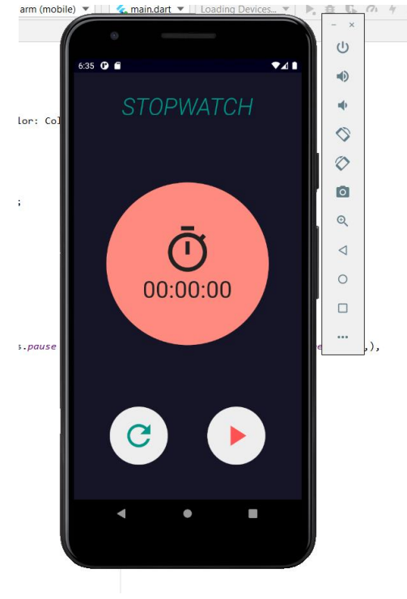
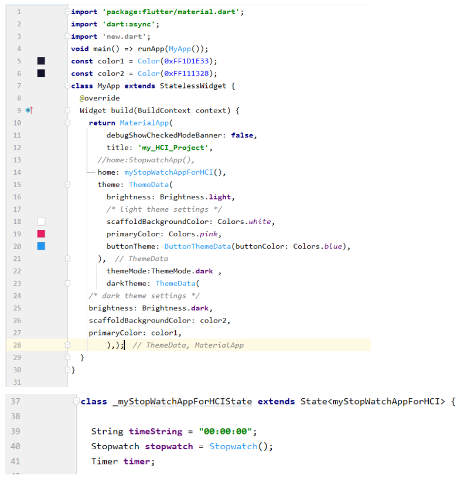
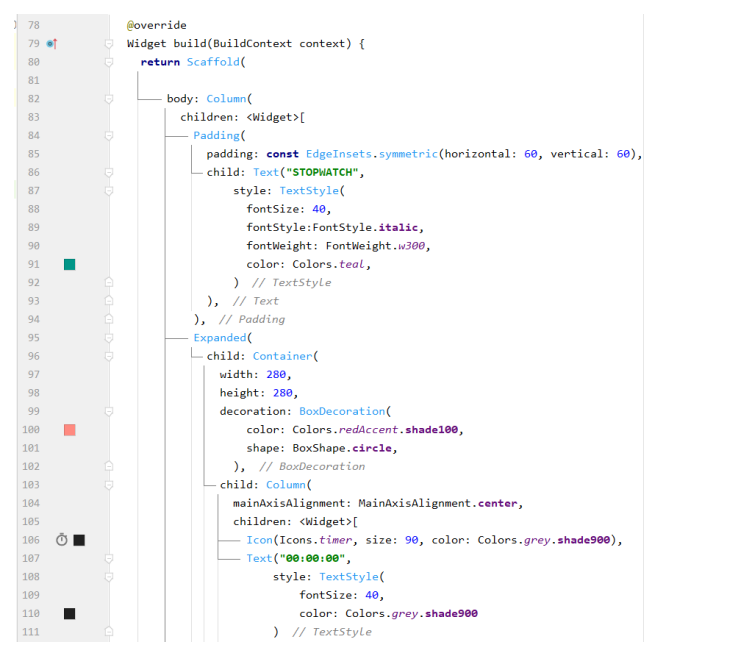
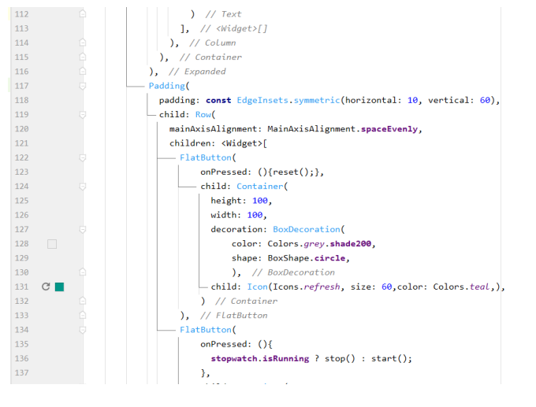
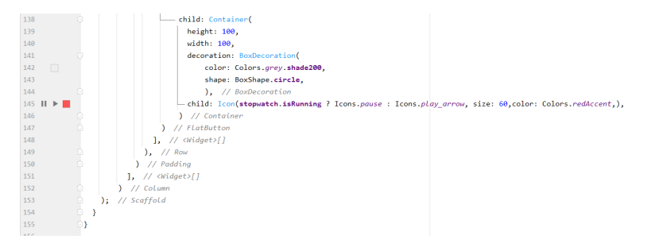
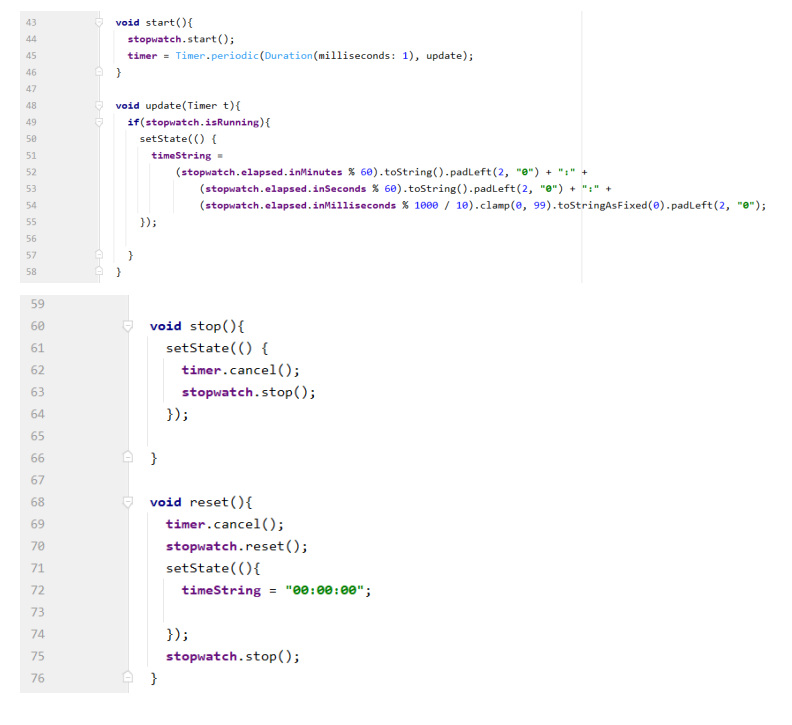

# Stopwatch

A Flutter application. A simple stopwatch app with neumorphism design. The app has the additional functionality of timer as well.

## I will start with the designing screenshots code

1. Adding header text
2. Stylizing the text
3. Adding padding
4. Adding container widget
5. Stylizing container with BoxDecoration
6. Setting background color
7. Adding counter icon
8. Adding counter text
9. Aligning a column
   10.Adding and stylizing the reset button
   11.Adding, aligning and padding the play button

After creating the stateful widget, I moved the app to that stateful widget.
Now using the timer class as well as the stopwatch class from flutter.

## Adding that stopwatch functions

